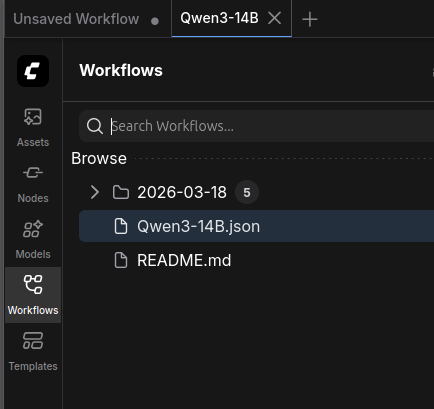

# ComfyUI-my-saved-workflows

Synchronized from `ComfyUI/user/default/`.

## setup

```bash
~/workspace/ComfyUI/user$ git clone git@github.com:liusida/ComfyUI-my-saved-workflows.git default
```

Accessible from Frontend GUI:


